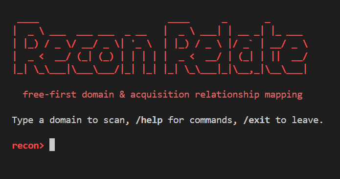

# ReconRelate

ReconRelate is a CLI-first reconnaissance relationship mapper.



Current implementation status (early alpha):

1. `run` executes a deterministic-first pivot workflow and can escalate ambiguous evidence to a configured local or cloud LLM.
2. Data is stored in SQLite. The current run graph remains compatible while a migrated,
   provenance-aware observation and claim ledger is being integrated underneath it.
3. `tree`, `report`, and `export` commands render findings.
4. Free providers work without API keys; optional BYOK providers are listed by `reconrelate providers`.
5. Bare `reconrelate` (or `python run.py` with no domain) opens an interactive shell with slash
   commands (`/run`, `/model`, `/providers`, ...) — every one-shot subcommand still works
   unchanged for scripts and CI.

The CLI is the primary product interface. ReconRelate is being developed as an open-source,
free-first local tool.

## What it finds

Point it at a company and it maps the *other* domains that company owns or acquired — the
freshly-acquired, less-tested scope that matters for authorized recon. Free profile, no API keys:

```text
$ reconrelate quick automattic.com --acquisitions

automattic.com
  wordpress.com   (owns)      woocommerce.com (owns)
  tumblr.com      (owns)      jetpack.com     (owns)
  akismet.com     (owns)      pocketcasts.com (owns)
  dayoneapp.com   (owns)      beeper.com      (owns)
```

## Measured quality — a number, not a claim

On a public known-truth case (Automattic, 11 documented properties), the free profile scores
**precision 0.89, recall 0.73** against a labeled evaluation case. Reproduce it end to end:

```powershell
reconrelate run automattic.com --mode quick --max-depth 1 --acquisitions --profile free
reconrelate export <run_id> --out out
reconrelate eval out\<run_id>.graph.json --case tests\eval\cases\automattic-v1.json --json
```

This is an **early alpha**: the evaluation corpus is small and quality is measured, not yet
release-gated. See `tests/eval/BASELINE.md` for the baseline and its known misses, and
`SYSTEM_DESIGN.md` for the architecture and known weaknesses behind that number.

## Quick Start

Run these from the project root:

```powershell
python -m venv .venv
.\.venv\Scripts\Activate.ps1
python -m pip install -U pip
pip install -e .
```

Optional: start from the recommended environment template:

```powershell
Copy-Item .env.example .env
# Then edit .env if you want to set LLM_MODEL / keys.
```

The installed command is `reconrelate`. Start with the smallest useful command:

```powershell
reconrelate example.com
reconrelate quick example.com
```

`reconrelate <domain>` uses the default deep preset. `quick` is a low-budget, shallow first look. Use `help` at any point to see examples:

```powershell
reconrelate help
reconrelate help run
reconrelate providers
reconrelate providers doctor
```

After a run, compare evidence contribution with recorded provider usage entirely offline:

```powershell
reconrelate providers value --run-id <run_id>
reconrelate providers value --run-id <run_id> --json
```

The value report distinguishes sole-family support from corroborated support, but deliberately does
not call either one causal provider lift. Paid-versus-free lift requires matched benchmark runs.

Compare exported free and BYOK runs against the same labeled case without contacting any service:

```powershell
reconrelate providers compare `
  --baseline artifacts\free.graph.json `
  --candidate artifacts\byok.graph.json `
  --case tests\eval\cases\organization.json
```

The command rejects conflicting crawl policies, reports labeled quality and usage deltas, and keeps
planner learning disabled until minimum label counts are met and candidate-only findings are labeled.

Aggregate multiple matched organizations with a path-portable benchmark manifest:

```powershell
reconrelate providers benchmark --manifest tests\eval\benchmark.example.json
```

`providers doctor` validates manifests and required API-key configuration without making network
or billable calls. Use `--json` for automation. Provider calls made during a run are included in
JSON exports and Markdown reports with status, attempts, latency, and conservatively counted paid
units. See [the provider adapter contract](docs/PROVIDER_CONTRACT.md) before adding an API.

Inspect model support before a run:

```powershell
reconrelate models list
reconrelate models doctor
```

`models list` shows the release-versioned catalog and clearly separates transport compatibility
from held-out quality evidence. `models doctor` checks the effective model, strict-output policy,
timeouts, local Ollama reachability/model installation, or cloud gate and credential presence. It
never generates text or calls a cloud API. ReconRelate does not automatically recommend an
unevaluated model.

Run a matched deterministic-versus-model benchmark over saved, provenance-labeled evidence:

```powershell
reconrelate models benchmark `
  --manifest tests\eval\model_benchmark.example.json `
  --model qwen2.5:7b-instruct
```

The checked-in manifest is only a synthetic smoke test and cannot make a model recommendation.
Cloud benchmarks additionally require cloud configuration, `--approve-cloud`, and positive hard
token and `--max-cloud-cost-usd` ceilings. Benchmarking never collects live recon evidence; each labeled case supplies the
same saved evidence to the deterministic baseline and model-assisted path.

Optionally route ambiguous cases through an economical model before the primary model:

```powershell
reconrelate run example.com `
  --fast-model qwen2.5:7b-instruct `
  --model mannix/llama3.1-8b-abliterated:q5_K_M
```

Only a strict, semantically valid fast result at or above the versioned confidence threshold avoids
the primary call. `models doctor` checks both installations and reports mixed local/cloud routing.

Preview provider selection and hard ceilings before a scan. This command is offline and performs
no database, network, model, or billable calls:

```powershell
reconrelate plan example.com --profile free
reconrelate plan example.com --profile byok --approve-paid --max-billable-units 10
```

The default `free` profile cannot activate billable providers, even when their keys are present.
An actual BYOK run requires both explicit approval and a positive billable-unit ceiling:

```powershell
reconrelate run example.com --profile byok --approve-paid --max-billable-units 10
```

`--budget` controls crawl breadth/depth; `--max-provider-calls` and
`--max-billable-units` are hard execution ceilings. See [query planning and spend safety](docs/QUERY_PLANNER.md).

Registration lookup is [RDAP-first](docs/RDAP.md): ReconRelate discovers the authoritative service
from IANA, preserves RDAP evidence, and uses legacy WHOIS only when RDAP lacks an identity pivot or
cannot answer. Pin `RECONRELATE_SOURCE_WHOIS=rdap-iana` to disable legacy fallback.

Use `RECONRELATE_DISABLE_PROVIDERS=whoxy,duckduckgo` as an immediate provider kill switch. Names
come from `reconrelate providers`; disabled adapters make no calls and consume no paid units.
`providers doctor --json` also reports each adapter's shared concurrency and per-minute safety
ceilings, plus maximum response bytes and result items. Per-provider environment overrides and the
adapter response contract are documented in the provider contract.
The optional paid [Whoxy adapter](docs/WHOXY.md) uses domain-only micro responses, explicit BYOK
approval, one-credit worst-case reservations, and strict secret-safe response validation.
Its balance can be queried only through the explicit bounded command
`providers balance --provider whoxy --approve-paid --max-billable-units 1`; routine diagnostics
remain offline.
Provider [data-use policies](docs/PROVIDER_DATA_POLICY.md) are enforced at shared-cache and JSON
export boundaries. Paid adapters cannot register without declaring one; Whoxy is run-local and
exports derived references only pending provider-specific legal review.
Manifests also cap nested upstream requests and pages per attempt; reports show both counts instead
of hiding multi-request adapters behind one logical call.
Contended calls wait in a bounded, cross-process FIFO queue; configure its deadline with
`RECONRELATE_PROVIDER_CAPACITY_WAIT_SEC` (default `5`). Waiting never consumes a paid unit.

[Subfinder integration](docs/SUBFINDER.md) is optional and automatically becomes the first passive
subdomain source when its binary is installed. Its JSONL source attribution is retained as claim
evidence; missing or failed installations fall back to crt.sh and HackerTarget. Corporate hierarchy
can also be queried from the free official [GLEIF Level 2 API](docs/GLEIF.md), with exact-name
abstention and accounting-specific relationship labels.

Completed acquisition evidence can optionally come from official [SEC EDGAR Item 2.01 filings](docs/SEC_EDGAR.md).
It requires a declared operator contact in `RECONRELATE_SEC_USER_AGENT`, but no API key or payment.

Bounded [Wayback historical evidence](docs/WAYBACK.md) is available through `reconrelate history`
and can be enabled during a scan with `--history`. Archived signals remain explicitly time-scoped.

The default current-page provider also records bounded [redirect and labelled legal-page identity
signals](docs/CURRENT_WEB_SIGNALS.md) with source URLs and conservative pivot rules.

The default doctor remains offline. To explicitly test supported free providers against a domain
you are authorized to assess, use `reconrelate providers doctor --live --target example.com`. Paid
providers are always skipped, and no evidence payload is printed or stored.

For a bounded or expanded run:

```powershell
reconrelate run example.com --budget medium --max-depth 2 --acquisitions --json
```

Copy the `run_id` from the output, then inspect or export it:

```powershell
reconrelate tree <run_id>
reconrelate report <run_id>
reconrelate export <run_id> --out artifacts
```

Evaluate a saved graph against a provenance-backed ground-truth case without making any network,
provider, database, or model calls:

```powershell
reconrelate eval artifacts\<run_id>.graph.json --case tests\eval\cases\example.json
reconrelate eval artifacts\<run_id>.graph.json --case path\to\case.json --json
```

The evaluator reports precision only over labeled predictions and lists unlabeled discoveries
separately. See `tests/eval/README.md` before adding real cases.

Graph JSON and JSON reports also include normalized `observations` and evidence-backed `claims`.
Markdown reports summarize observation counts by provider, so a CLI user can see which free or
BYOK source contributed the underlying evidence. Relationship claims show their confidence class,
score, scoring-policy version, and supporting or contradicting evidence. The JSON payload's
`claim_projection` is a deterministic graph rebuilt only from those claims and evidence, without
depending on legacy graph IDs.

Domain work is durably queued in SQLite. If a process or machine stops mid-run, use the same target
with `--resume`; leased unfinished tasks are reclaimed without changing the run ID. Reports include
pending, in-progress, succeeded, and failed task counts. See [the run recovery guide](docs/RUN_RECOVERY.md).

Windows-style slash shortcuts are also available for common actions:

```powershell
reconrelate /quick example.com /depth:1 /json
reconrelate /providers
reconrelate /help
```

## Database safety

The CLI can check, consistently back up, restore, and explicitly retain the local SQLite database:

```powershell
reconrelate db check
reconrelate db backup
reconrelate db restore path\to\snapshot.sqlite --yes
reconrelate db retention --before 2025-01-01
```

Retention is preview-only unless `--apply --yes` is provided. Restore and applied retention create
verified safety backups automatically. See [the database operations runbook](docs/DATABASE_OPERATIONS.md).

Useful dev test:

```powershell
pip install -e ".[dev]"
$env:PYTHONPATH='src'; python -m pytest -q
```

## Security

1. **Authorized use** — Run ReconRelate only against targets you are permitted to assess. It performs real WHOIS, HTTP, DNS, CT, and third-party queries.
2. **Secrets** — Do not commit `.env` with `OPENAI_API_KEY` or other provider keys. Prefer short-lived keys with least privilege.
3. **Data egress** — Pivot LLM calls send WHOIS-derived text to the configured model. Local **Ollama** is the default. Cloud requires administrative enablement, per-run `--approve-cloud`, and a positive `--max-cloud-tokens` ceiling; see [the model gateway](docs/MODEL_GATEWAY.md).
4. **Scan targets** — Direct HTTP adapters validate the exact DNS addresses used by aiohttp and every redirect hop, rejecting private, loopback, link-local, reserved, and metadata targets. See [the network security model](docs/SECURITY_MODEL.md).
5. **Disk** — SQLite and auto-saved artifacts are chmod `600` on Unix after creation. Prefer a user-owned `RECONRELATE_DB_PATH` and `RECONRELATE_ARTIFACTS_DIR`; delete runs when retention ends.
6. **Logging** — Avoid sharing logs that contain full WHOIS blobs in untrusted channels. litellm debug output is suppressed in-process.
7. **Blocking SDKs** — WHOIS, DNS, and DuckDuckGo execute in killable subprocesses with bounded JSON I/O and a stripped secret environment.

CI runs `pytest` and `pip audit` (see `.github/workflows/ci.yml`). Dependabot is enabled for pip (`.github/dependabot.yml`).

## Choosing a model

Any [LiteLLM-supported](https://docs.litellm.ai/docs/providers) provider works. Add it as a named
profile and assign it a role:

```powershell
reconrelate model add local qwen2.5:7b-instruct                 # Ollama, the default
reconrelate model add gem   gemini-3.6-flash --input-price 0.30 --output-price 2.50
reconrelate model add mini  gpt-5-mini                          # price already in the catalog
reconrelate model use gem --role primary
```

A cloud model additionally needs `allow_cloud true`, per-run `--approve-cloud`, and positive
`--max-cloud-tokens` / `--max-cloud-cost-usd` ceilings. A model with no entry in the built-in
price catalog must supply `--input-price` / `--output-price`, so no run can spend against an
unknown rate.

**The task is harder than it looks.** The model must return a strict JSON schema *and* judge
whether an identifier genuinely links two companies. Measured on the same fixture:

| Model | Result |
|---|---|
| `gemini-3.6-flash` | accepted &mdash; full `atlassian.com` scan, 3 calls, **$0.007**, 3.8&ndash;6.4 s/call |
| `qwen2.5:7b-instruct` (local Ollama) | accepted &mdash; same scan result, free, 7&ndash;14 s/call |
| `deepseek-chat`, `llama-3.3-70b-instruct` (OpenRouter) | accepted, well under a cent |
| `qwen3.8-max` (OpenRouter) | **invalid** &mdash; ignored the schema, despite costing ~50&times; the models that worked |
| `minimax-m3:free` | **invalid** &mdash; invented its own JSON shape |
| `nemotron-3-ultra:free` | abstained &mdash; correct format, but judged real evidence to be a placeholder |
| `glm-5.2:free` | rate-limited (HTTP 429) |

Free OpenRouter tiers are useful for smoke-testing the plumbing, but several either ignore the
response schema or abstain on evidence a capable model resolves confidently. Schema validation
catches these rather than admitting malformed output into the graph — an `invalid` disposition
in `reconrelate report` means the model failed, not the target. Price and availability change
often; re-check before relying on any row above.

## Supporting the project

ReconRelate is free-first by design: the default profile uses only free sources and a local
model, and that will not change. Two specific things are currently limiting how good it can get,
and both cost money rather than engineering time.

**Reverse-WHOIS data access.** The free reverse-WHOIS path is a web search, not a real
reverse-WHOIS database, so it is inherently noisy — noisy enough that `org`, `name`, and `ns`
pivots are excluded from it entirely because the false positives outweighed the signal. A proper
reverse-WHOIS provider returns registrant-indexed results instead of text matches. The
[Whoxy adapter](docs/WHOXY.md) is already built and tested; it needs credits, not code.

**A real evaluation corpus.** Quality is currently measured against exactly one labelled
company (`automattic.com`: precision 0.889, recall 0.727). That is a real number from a real
[offline evaluator](tests/eval/), but one case is not a claim about general accuracy. Getting to
10–20 human-reviewed known-truth organisations is mostly patient manual research — reading
filings and press releases and recording verifiable ground truth — and it is the single change
that would most improve confidence in every number this tool reports.

If you would like to help fund either, sponsorship is welcome via the Sponsor button (see
[`.github/FUNDING.yml`](.github/FUNDING.yml)). Contributions of labelled evaluation cases are
equally valuable and cost nothing — see [`tests/eval/README.md`](tests/eval/README.md) for the
case format.

## Notes

1. Providers are registered in `src/reconrelate/data_gathering/registry.py`.
2. WHOIS, basic intel, and reverse pivots all use free Python modules/resources.
3. Relationship orchestration lives under `src/reconrelate/orchestrator/`.
4. CLI command handling is in one file: `src/reconrelate/cli/app.py`.
5. Set `LLM_MODEL` for local Ollama or a LiteLLM-supported cloud model. An API key alone cannot enable cloud spending.
6. Offline quality evaluation lives in `src/reconrelate/quality/`; versioned cases and fixtures live in `tests/eval/`.
