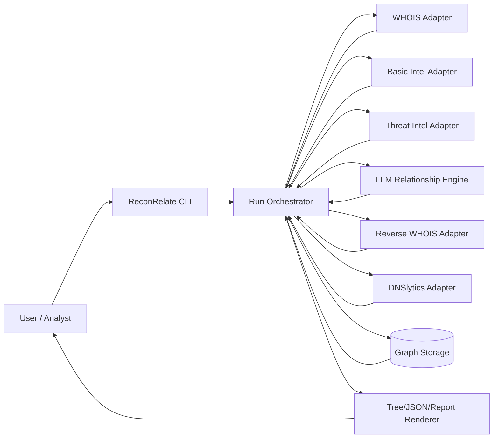
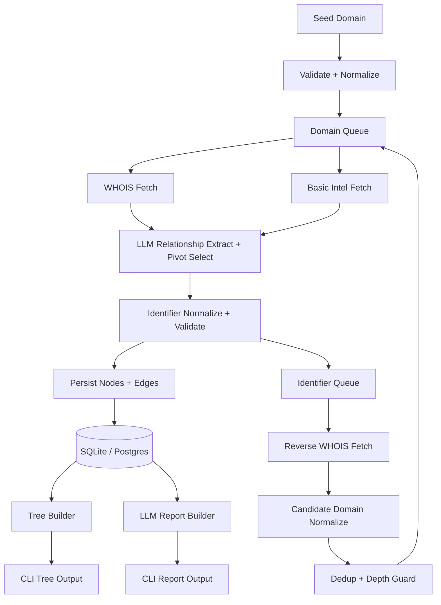

# ReconRelate AI Implementation Blueprint

## 1) Objective
Build a CLI-first reconnaissance mapping tool that:

1. Takes a root domain as input.
2. Collects WHOIS and reverse WHOIS intelligence recursively.
3. Stores only core entities for MVP: domains, identifiers, relationships, depth lineage.
4. Produces a tree/graph view from root to configured depth.
5. Uses LLM as the main relationship engine to select reverse-WHOIS pivots from WHOIS + basic intel.

This plan is designed for fast delivery in Python now, with clear boundaries for future multi-language components.

## 2) MVP Scope

### In scope
1. CLI commands to run, inspect, and export recon runs.
2. WHOIS lookup, basic intel lookup, and reverse WHOIS lookup via provider adapters.
3. Recursive crawl with depth, deduplication, and safety limits.
4. SQLite persistence with migration path to Postgres.
5. Tree and JSON output.
6. LLM relationship extraction and pivot selection before reverse WHOIS.

### Out of scope (v1)
1. Web UI and SaaS tenancy.
2. Real-time collaboration.

### Advanced OSINT Scope (v1.5)
1. **Shadow IT Clustering**: Extract Analytics/AdSense tracking IDs and use DNSlytics for correlation.
2. **Threat Intelligence**: Annotate IPs/domains using AbuseIPDB or VirusTotal to prevent recursion into malicious infrastructure.
3. **Shared Infrastructure Pivoting**: Use DomScan or DNSlytics for Reverse IP and Reverse NS correlation.
4. **Web Stack Fingerprinting**: Use Wappalyzer to map attack surface.
5. **Architectural Security Resiliency**: Strict bucket rate limits and aggressive local caching for free-tier APIs.

## 3) Architecture Overview

### Core principle
Use LLM-guided pivot selection as the core intelligence step, with deterministic validation and crawl guardrails for reproducibility.

### DFD Level 0


### DFD Level 1


## 4) Pipeline (LLM-Guided BFS, Recommended)

1. Create `run_id` and insert root domain at depth `0`.
2. Push root into `domain_queue`.
3. Pop next domain.
4. Fetch WHOIS and basic intel facts (company snippets, title/meta, **Google Analytics/AdSense Tracking IDs**). 
5. Fetch IP addresses and run them against **Threat Intel Providers** (AbuseIPDB/VT). Flag if compromised.
6. Send WHOIS + basic intel + current run context + Threat Scores to LLM relationship engine.
7. LLM returns structured pivot candidates (`identifier`, `type`, `reason`, `score`).
8. Validate and normalize returned identifiers (`email`, `org`, `name`, `phone`, `ns`, `tracking_id`).
9. Persist domain node, identifier nodes, and `domain -> identifier` edges with source `llm_pivot` and Threat `confidence`.
10. For each unseen/high-score identifier, call appropriate reverse provider:
    - Reverse WHOIS provider (for email, name, org).
    - DNSlytics provider (for tracking_id, shared IP, or custom NS).
11. Normalize returned related domains and create `identifier -> domain` edges.
12. (Optional) Run Wappalyzer to extract tech-stack fingerprint for newly discovered active web properties.
13. Add unseen domains to queue at `depth + 1`.
14. Stop on guardrails: `max_depth`, `max_domains`, `max_edges`, `timeout`.
13. Build lineage tree rooted at initial domain.
14. Generate final LLM narrative report from stored graph evidence.
15. Render outputs: ASCII tree, JSON graph, markdown report.

### Guardrails
1. Hard depth cap (`max_depth` default 2 or 3).
2. LLM pivot allowlist by identifier type and strict JSON schema validation.
3. Per-domain pivot cap (`top_k_identifiers`) and per-identifier domain fanout cap.
4. Global node and edge limits per run.
5. Rate limit and retry with exponential backoff.

## 5) Repository Blueprint (CLI-First)

```text
reconrelate/
  pyproject.toml
  README.md
  .env.example
  context/
    implementation.md
  src/
    reconrelate/
      __init__.py
      cli/
        app.py
        commands/
          run.py
          tree.py
          report.py
          export.py
      core/
        models.py
        types.py
        errors.py
        normalize.py
      pipeline/
        orchestrator.py
        queue.py
        guards.py
      providers/
        base.py
        whois_base.py
        basic_info_base.py
        reverse_whois_base.py
        threat_intel_base.py
        whois_provider.py
        basic_info_provider.py
        reverse_whois_provider.py
        dnslytics_provider.py
        abuseipdb_provider.py
        wappalyzer_provider.py
      storage/
        db.py
        schema.sql
        repositories.py
        migrations/
      analysis/
        llm_client.py
        relationship_engine.py
        pivot_schema.py
        prompt_builder.py
        insight_schema.py
      output/
        tree_renderer.py
        json_renderer.py
        report_renderer.py
      config/
        settings.py
        logging.py
  tests/
    unit/
    integration/
    fixtures/
```

## 6) Module Contracts

### Provider interfaces
Define strict interfaces so provider implementations are swappable.

1. `WhoisProvider.lookup(domain: str) -> WhoisRecord`
2. `BasicInfoProvider.lookup(domain: str) -> BasicIntelRecord` (includes Tracking IDs)
3. `ReverseWhoisProvider.search(identifier: Identifier) -> list[str]`
4. `DNSlyticsProvider.search(identifier: Identifier) -> list[str]`
5. `ThreatIntelProvider.check_ip(ip: str) -> ThreatScore`
6. `WappalyzerProvider.fingerprint(domain: str) -> list[str]`

### Storage contracts
1. `create_run(config) -> run_id`
2. `upsert_domain(domain) -> domain_id`
3. `upsert_identifier(identifier) -> identifier_id`
4. `add_edge(run_id, from_node, to_node, relation_type, depth, source)`
5. `mark_processed(node, run_id)`
6. `fetch_run_graph(run_id) -> GraphSnapshot`
7. `add_pivot_decision(run_id, domain, identifier, score, reason)` (optional audit table)

### Analysis contract
1. Input: `{domain, whois_facts, basic_intel_facts, graph_context}`.
2. Pivot output (strict JSON):
   - `pivot_identifiers[]` with `value`, `type`, `score`, `reason`
   - `relationship_hypotheses[]`
   - `discarded_candidates[]`
3. Final report output:
   - `key_clusters`
   - `ownership_hypotheses`
   - `anomalies`
   - `next_pivots`
   - `confidence_notes`

## 7) Data Model (MVP)

### Tables
1. `runs`
   - `id`, `root_domain`, `status`, `max_depth`, `created_at`, `completed_at`
2. `nodes`
   - `id`, `run_id`, `node_type` (`domain|identifier`), `value_norm`, `value_hash`, `metadata_json` (Stores: TechStack, AbuseScore, TrackingIDs)
3. `edges`
   - `id`, `run_id`, `from_node_id`, `to_node_id`, `relation_type`, `depth`, `source`, `confidence`, `created_at`
4. `lineage`
   - `run_id`, `child_node_id`, `parent_node_id`, `depth`
5. `run_stats`
   - `run_id`, `domains_count`, `identifiers_count`, `edges_count`, `duration_ms`
6. `pivot_decisions` (optional, lightweight audit)
   - `run_id`, `domain_node_id`, `identifier_value_norm`, `identifier_type`, `score`, `reason_short`

### Relation types
1. `domain_has_identifier`
2. `identifier_links_domain`
3. `derived_from_root`
4. `llm_selected_pivot`

## 8) CLI Command Contract

1. `reconrelate run <domain> --max-depth 3 --max-nodes 1500 --pivot-top-k 8 --json`
   - Executes crawl and prints run summary.
2. `reconrelate tree <run_id> --format ascii|json`
   - Renders root-to-depth mapping.
3. `reconrelate report <run_id> --format md|json`
   - Outputs deterministic findings + LLM insight layer.
4. `reconrelate export <run_id> --out ./artifacts`
   - Saves tree, graph JSON, and report.

## 9) Config Strategy

1. Use `.env` + typed settings loader.
2. Required keys:
   - `WHOIS_PROVIDER`
   - `WHOIS_API_KEY`
   - `BASIC_INFO_PROVIDER`
   - `BASIC_INFO_API_KEY`
   - `REVERSE_WHOIS_PROVIDER`
   - `REVERSE_WHOIS_API_KEY`
   - `DNSLYTICS_API_KEY` (if using shadow IT discovery)
   - `ABUSEIPDB_API_KEY` (for threat scoring)
   - `WAPPALYZER_API_KEY` (for tech stack mapping)
   - `OPENAI_API_KEY` (if LLM enabled)
3. Runtime knobs:
   - `DEFAULT_MAX_DEPTH`
   - `PIVOT_TOP_K`
   - `PIVOT_SCORE_THRESHOLD`
   - `MAX_DOMAINS_PER_IDENTIFIER`
   - `GLOBAL_MAX_NODES`
   - `REQUEST_TIMEOUT_SEC`
   - `RETRY_COUNT`

## 10) Error Handling and Reliability

1. Provider failures should not crash entire run; mark partial and continue.
2. Distinguish fatal errors (invalid input, db unavailable) from recoverable (429, timeout).
3. **Strict Rate Limiting & Pacing:** Implement explicit Bucket rate-limiters or respect `X-Rate-Limit` HTTP headers to avoid burning free-tier API quotas.
4. **Aggressive Cache Layer:** Cache everything in the local SQLite DB to prevent duplicate API hits across multiple run invocations. 
5. Persist checkpoints frequently to support resumable runs later.
6. Emit structured logs with `run_id` correlation.
7. If LLM pivot call fails, apply deterministic fallback extraction from WHOIS fields and continue.

## 11) Security and Compliance Baseline

1. Log only normalized values; hash sensitive identifiers where practical.
2. Keep raw WHOIS/basic payload persistence disabled by default.
3. Add retention policy controls for stored recon data.
4. Track source provenance on each edge for auditability.

## 12) Testing Plan

1. Unit tests
   - normalizers, dedupe logic, depth guards, pivot validator, tree renderer
2. Integration tests
   - provider adapters + LLM pivot JSON contract with mocked responses
3. E2E tests
   - full run with fixtures, assert expected node/edge counts and depth structure
4. Regression tests
   - stable JSON output contract snapshots

## 13) Delivery Plan

### Milestone 1 (Week 1)
1. CLI skeleton (`run`, `tree`)
2. SQLite schema and repositories
3. WHOIS + basic intel adapters and LLM pivot schema

### Milestone 2 (Week 2)
1. Reverse WHOIS adapter
2. LLM-guided BFS recursion, dedupe, guardrails
3. Tree renderer

### Milestone 3 (Week 3)
1. Report command
2. LLM narrative report integration
3. Export artifacts and improved tests

## 14) Multi-Language Expansion Path

Use Python as orchestrator and contract owner. Move heavy collectors later without rewrite.

1. Keep provider contracts network-facing (JSON over HTTP/gRPC).
2. Optionally replace `providers/*` with Go/Rust microservice adapters.
3. Preserve same graph schema and command outputs.
4. Keep deterministic crawl rules in one place (orchestrator contract tests).

## 15) Definition of Done (MVP)

1. `reconrelate run example.com --max-depth 2` completes successfully.
2. WHOIS + basic intel are sent to LLM and produce validated pivot identifiers.
3. Output graph includes domain and identifier relationships with depth lineage.
4. Reverse WHOIS pivots are traceable to `llm_selected_pivot` decisions.
5. Duplicate loops are prevented across repeated identifiers/domains.
6. `tree` and `report` commands render usable analyst outputs.
7. LLM insights remain linked to deterministic evidence edges.

## 16) Advanced OSINT Technical Implementation Plan (v1.5)

### Data Gathering Providers (Enrichment)

- **basic_info_provider.py**: Integrate regex parsing on the fetched HTML to extract Google Analytics and Google AdSense IDs. Update `BasicIntelRecord` to hold tracking_ids.
- **dnslytics_provider.py**: Create `DNSlyticsProvider` to query the DNSlytics API for ReverseGAnalytics, ReverseAdsense, and ReverseIP. Implement robust 429 handling and a fallback to DDGS.
- **abuseipdb_provider.py**: Create `ThreatIntelProvider` fetching abuse confidence scores for resolved IP addresses. Cache heavily on local nodes.
- **wappalyzer_provider.py**: Create `WappalyzerProvider` for tech stack fingerprinting.

### Core Logic & Resilience

- **settings.py**: Expose `DNSLYTICS_API_KEY`, `ABUSEIPDB_API_KEY`, and `WAPPALYZER_API_KEY` in the environment loader.
- **resilience.py**: Add a new `RateLimiter` class (Token Bucket algorithm) that can pause threads to respect X-Rate-Limit HTTP headers natively. Add `SQLiteCache` wrap.

### Pipeline Orchestrator

- Extract tracking IDs from basic info step and pass them into LLM context.
- Prior to appending a newly discovered domain to the queue, run the domain's A-record against the `ThreatIntelProvider`. If abuse_score > 90%, flag it.
- During reverse lookups, trigger `DNSlyticsProvider` when LLM selects a tracking ID or an IP address.
- Pass new metadata to `repository.get_or_create_node()` to persist AbuseScores, TechStack, and TrackingIDs.
