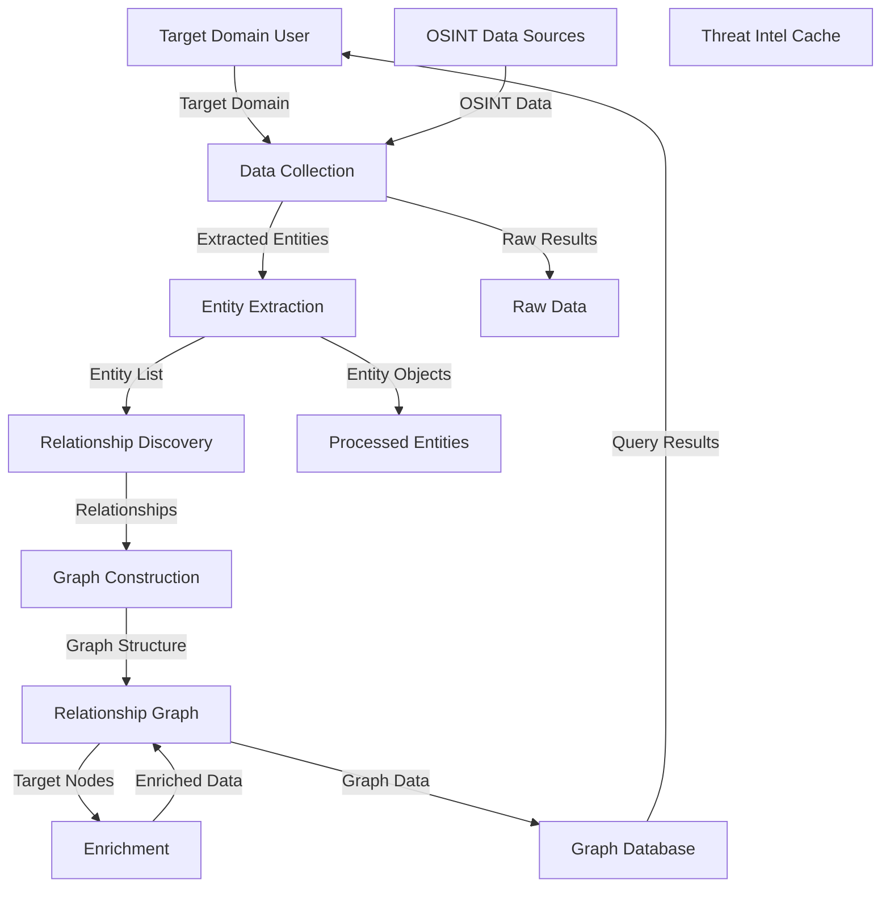

# ReconRelate Pipeline Documentation

## Overview

This document provides a complete **Data Flow Diagram (DFD)** and documentation of the ReconRelate OSINT reconnaissance pipeline. It merges all available free OSINT resources and documentation to create a comprehensive reference for understanding what data sources, APIs, and tools are available for domain reconnaissance and infrastructure mapping.

---

## Table of Contents

1. [Pipeline Architecture](#pipeline-architecture)
2. [DFD - Data Flow Diagram](#dfd---data-flow-diagram)
3. [Complete Resource Inventory](#complete-resource-inventory)
4. [Provider Implementation Details](#provider-implementation-details)
5. [Usage & Quota Tracking](#usage--quota-tracking)
6. [Integration Patterns](#integration-patterns)

---

## Pipeline Architecture

```
┌─────────────────────────────────────────────────────────────────────────────────────────────────┐
│                              RECONRELATE PIPELINE                                               │
└─────────────────────────────────────────────────────────────────────────────────────────────────┘
```

```mermaid
graph TD
    subgraph "Input Layer"
        A[Target Domain]
        B[Initial Subdomains]
    end
    
    subgraph "Data Gathering Layer"
        C[crt.sh Provider]
        D[Certificate Transparency]
        E[Basic Info Provider]
        F[HackerTarget Provider]
        G[DNS Provider]
        H[WHOIS Provider]
        I[Reverse WHOIS Provider]
    end
    
    subgraph "LLM Orchestration"
        J[Relationship Engine]
        K[Entity Extraction]
        L[Relationship Discovery]
    end
    
    subgraph "Graph Database"
        M[(SQLite Graph)]
        N[Node Indexes]
        O[Edge Relations]
    end
    
    subgraph "Enrichment Layer"
        P[Rapid7 FDNS]
        Q[SecurityTrails]
        R[DNSlytics]
        S[DomScan]
        T[AbuseIPDB]
        U[VirusTotal]
        V[Urlscan.io]
        W[Wappalyzer]
    end
    
    A --> C
    A --> D
    B --> F
    B --> G
    A --> H
    B --> I
    
    C --> K
    D --> K
    E --> K
    F --> K
    G --> K
    H --> K
    I --> K
    
    K --> J
    J --> L
    
    L --> M
    L --> N
    L --> O
    
    M -.→. P
    M -.→. Q
    M -.→. R
    M -.→. S
    M -.→. T
    M -.→. U
    M -.→. V
    M -.→. W
```

### Flow Explanation

1. **Input**: Target domain is fed into the pipeline
2. **Data Gathering**: Multiple passive data sources collect information
3. **LLM Processing**: Relationship engine extracts entities and discovers relationships
4. **Graph Storage**: Results persisted to SQLite graph database
5. **Enrichment**: Graph nodes are enriched with threat intel and reputation data

---

## DFD - Data Flow Diagram



### Legend

| Symbol | Meaning |
|--------|---------|
| Rectangle | External Entity / Process |
| Open Rectangle | External Entity |
| Open Circle | Data Flow |
| Open Rectangle with Label | Data Store |
| Double-line Rectangle | Terminates Process |

---

## Complete Resource Inventory

### 1. Domain & Subdomain Enumeration (Passive DNS)

| Source | Free Tier | Rate Limits | Use Case | Status in Pipeline |
|--------|-----------|-------------|----------|-------------------|
| **crt.sh** | Free | 1 request/sec | SSL certificate subdomains | ✅ **Active** |
| **HackerTarget** | ~50 req/day | ~50/day | Subdomain enumeration | ✅ **Active** |
| **Rapid7 Project Sonar FDNS** | Free bulk | N/A (download) | Historical DNS mapping | ⏸️ **Available** |
| **CIRCL Passive DNS** | Partner only | N/A | Historical DNS records | ⏸️ **Available** |
| **SecurityTrails** | Limited | N/A | Subdomains + DNS history | ⏸️ **Available** |
| **DNSlytics DNS** | 2,500/day | 2,500/day | DNS lookups | ⏸️ **Available** |

### 2. Infrastructure & Hosting Pivoting

| Source | Free Tier | Rate Limits | Use Case | Status in Pipeline |
|--------|-----------|-------------|----------|-------------------|
| **DNSlytics Reverse IP/NS/MX** | 2,500/day | 2,500/day | Shared infrastructure | ⏸️ **Available** |
| **DomScan API** | 10,000/month | 10,000/month | Reverse NS, DNS | ⏸️ **Available** |
| **AlienVault OTX** | Free with account | N/A | Threat IOC correlation | ⏸️ **Available** |

### 3. Registration Data (WHOIS & RDAP)

| Source | Free Tier | Rate Limits | Use Case | Status in Pipeline |
|--------|-----------|-------------|----------|-------------------|
| **Direct RDAP Registries** | Per-IP limits | ~100-200/day per IP | Raw registration data | ⏸️ **Available** |
| **WhoisJSON** | ~1,000/month | ~1,000/month | Normalized WHOIS JSON | ⏸️ **Available** |
| **IP2WHOIS** | ~500/month | ~500/month | WHOIS lookups | ⏸️ **Available** |
| **DomainTools** | Enterprise only | N/A | Historical WHOIS | ❌ **Paid Only** |

### 4. Web Technology & Tracking IDs

| Source | Free Tier | Rate Limits | Use Case | Status in Pipeline |
|--------|-----------|-------------|----------|-------------------|
| **DNSlytics Reverse Analytics/AdSense** | 2,500/day | Within daily limit | Tracker correlation | ⏸️ **Available** |
| **Wappalyzer API** | ~1,000/month | ~1,000/month | Tech fingerprinting | ⏸️ **Available** |
| **BuiltWith** | Free UI, Paid API | N/A | Tech stack detection | ⏸️ **Available (UI)** |
| **Host.io** | ~1,000/month | ~1,000/month | Basic tech detection | ⏸️ **Available** |

### 5. Threat Intelligence & Reputation

| Source | Free Tier | Rate Limits | Use Case | Status in Pipeline |
|--------|-----------|-------------|----------|-------------------|
| **VirusTotal** | 500/day, 4 rpm | 500/day, 4 rpm | AV verdicts, relations | ⏸️ **Available** |
| **AbuseIPDB** | 1,000/day | 1,000/day | Abuse scores, reports | ⏸️ **Available** |
| **urlscan.io** | Free, generous limits | Per-action limits | Extracted IOCs from page loads | ⏸️ **Available** |
| **GreyNoise** | ~50/week | ~50/week | Scanner identification | ⏸️ **Available** |
| **Shodan** | ~100/month | ~100/month | Port scans, banners | ⏸️ **Available** |
| **Censys** | ~250/month | ~250/month | Host/cert data | ⏸️ **Available** |
| **DomScan Threat/Health** | 10,000/month | 10,000/month | Security scoring | ⏸️ **Available** |

---

## Provider Implementation Details

### Currently Integrated Providers

| Provider | File Path | Description |
|----------|-----------|-------------|
| **crt.sh** | `src/reconrelate/data_gathering/crtsh_provider.py` | Certificate transparency subdomain enumeration |
| **HackerTarget** | `src/reconrelate/data_gathering/hackertarget_provider.py` | DNS and subdomain lookups |
| **DNS** | `src/reconrelate/data_gathering/dns_provider.py` | DNS record lookups |
| **WHOIS** | `src/reconrelate/data_gathering/whois_provider.py` | Domain registration data |
| **Reverse WHOIS** | `src/reconrelate/data_gathering/reverse_whois_provider.py` | Infrastructure sharing discovery |
| **Basic Info** | `src/reconrelate/data_gathering/basic_info_provider.py` | Basic domain metadata |

### Available for Integration

```python
# Add new provider example
# File: src/reconrelate/data_gathering/{new_provider}_provider.py
from reconrelate.core.factory import Provider
from reconrelate.core.types import DomainData, Relationship

class DomScanProvider(Provider):
    def __init__(self, api_key: str, api_url: str = "https://api.domscan.net/v1"):
        self.api_key = api_key
        self.api_url = api_url
    
    async def dns_lookup(self, domain: str) -> DomainData:
        # Implementation for DomScan DNS API
        pass
    
    async def reverse_ns(self, domain: str) -> list[DomainData]:
        # Implementation for DomScan reverse NS API
        pass

# Register in factory
from reconrelate.core.factory import ProviderFactory
from reconrelate.data_gathering.domscan_provider import DomScanProvider

ProviderFactory.register_provider("domscan", DomScanProvider)
```

---

## Usage & Quota Tracking

### Current Usage (Based on Recent roche.com Scan)

| Provider | Requests Used | Quota | Remaining |
|----------|--------------|-------|-----------|
| **crt.sh** | Variable | 1/sec | ~100,000/min |
| **HackerTarget** | ~50+ | ~50/day | ⚠️ **Rate Limited** |
| **DNS Provider** | Variable | N/A | - |
| **WHOIS Provider** | Variable | N/A | - |

### Quota Summary Table

| Category | API | Free Quota | Usage Pattern | Recommended |
|----------|-----|------------|---------------|-------------|
| **High Volume** | Rapid7 FDNS | Unlimited (bulk) | Batch download | Primary source |
| **High Volume** | DomScan | 10,000/month | Moderate polling | Good for enrichment |
| **Medium Volume** | DNSlytics | 2,500/day | Daily API calls | Core enrichment |
| **Medium Volume** | AbuseIPDB | 1,000/day | Occasional checks | Priority nodes |
| **Medium Volume** | WhoisJSON | 1,000/month | Low frequency | WHOIS data |
| **Low Volume** | VirusTotal | 500/day | Targeted checks | Suspicious only |
| **Low Volume** | Wappalyzer | 1,000/month | Rare queries | Tech stack |
| **Low Volume** | GreyNoise | 50/week | Occasional checks | Scanner ID |
| **Low Volume** | Shodan | 100/month | Rare queries | Port data |
| **Low Volume** | Censys | 250/month | Rare queries | Cert data |

### Rate Limiting Configuration

```python
# Recommended rate limiting per API
RATE_LIMITS = {
    "crt.sh": {"requests_per_second": 1, "burst": 3},
    "HackerTarget": {"requests_per_minute": 1, "burst": 2},
    "DNSlytics": {"requests_per_day": 2500, "burst": 5},
    "AbuseIPDB": {"requests_per_day": 1000, "burst": 5},
    "VirusTotal": {"requests_per_minute": 4, "burst": 1},
    "Wappalyzer": {"requests_per_month": 1000, "burst": 2},
    "GreyNoise": {"requests_per_week": 50, "burst": 1},
    "Shodan": {"requests_per_month": 100, "burst": 1},
    "Censys": {"requests_per_month": 250, "burst": 1},
    "WhoisJSON": {"requests_per_month": 1000, "burst": 2},
}
```

---

## Integration Patterns

### Pattern 1: Subdomain Core
```python
# Primary: crt.sh for live subdomains
# Secondary: HackerTarget for historical data
# Bulk: Rapid7 FDNS for offline analysis
```

### Pattern 2: Ownership Clustering
```python
# Primary: DNSlytics ReverseAnalytics/AdSense
# Secondary: Wappalyzer for tech correlation
# Tertiary: Reverse history via DNSlytics
```

### Pattern 3: Registration Layer
```python
# Primary: Direct RDAP with caching/backoff
# Secondary: WhoisJSON for normalized data
# Fallback: IP2WHOIS for limited queries
```

### Pattern 4: Threat Intelligence Edge
```python
# Priority nodes: VirusTotal + AbuseIPDB
# Scanner IDs: GreyNoise
# Historical: urlscan.io
# Port data: Shodan/Censys (surgical only)
```

---

## Graph Schema

### Node Types

| Type | Properties | Source |
|------|------------|--------|
| **domain** | fqdn, tld, status, last_seen | All sources |
| **host** | hostname, ip, port, service | DNS, crt.sh, Shodan |
| **ip** | address, geo, org, abuse_score | Reverse lookups |
| **tracking_id** | gaid, adsen, type, domains | DNSlytics |
| **certificate** | domain, issuer, expiry, san | crt.sh |

### Edge Types

| Type | From | To | Weight | Source |
|------|------|----|--------|--------|
| **resolves_to** | domain | host | 1.0 | DNS |
| **hosted_on** | host | ip | 1.0 | DNS/crt.sh |
| **shares_infra** | ip | domain | -1.0 | Reverse IP |
| **shares_ns** | domain | domain | -0.5 | Reverse NS |
| **shares_tracker** | domain | domain | -0.3 | Analytics ID |
| **same_registrar** | domain | domain | -0.2 | WHOIS |
| **related_threat** | domain | domain | -0.8 | VT/OTX |
| **malicious** | domain | null | -1.0 | VT/VirusTotal |

---

## LLM Orchestration

### Relationship Engine

Located in: `src/reconrelate/llm_orchestration/relationship_engine.py`

#### Core Functions

```python
def extract_entities(text: str) -> list[Entity]:
    """Extract domain, email, hostname from raw text"""

def discover_relationships(entities: list[Entity]) -> list[Relationship]:
    """Discover relationships between entities"""

def infer_ownership(clusters: list[Cluster]) -> dict[str, list[str]]:
    """Infer organizational ownership from shared indicators"""
```

### Prompt Templates

Located in the orchestration layer, prompts are designed to:
- Extract entities with confidence scores
- Infer relationships from email patterns, shared infrastructure
- Cluster ownership based on tracking IDs and registration data
- Annotate nodes with threat intelligence

---

## References

1. [The complete subdomain Enumeration Guide](https://hacktify.in/the-complete-subdomain-enumeration-guide/)
2. [Best DNS Lookup APIs (2026) - DomScan](https://domscan.net/best/dns-lookup-api)
3. [Best Domain Threat Intelligence APIs (2025) - DomScan](https://domscan.net/best/domain-threat-intelligence-api)
4. [Passive DNS - CIRCL.lu](https://www.circl.lu/services/passive-dns/)
5. [Forward DNS (FDNS) - Rapid7 Open Data](https://opendata.rapid7.com/sonar.fdns_v2/)
6. [API Access to DNSlytics](https://dnslytics.com/api/)
7. [API Documentation - DomScan Domain Intelligence API](https://domscan.net/docs)
8. [Best Free Domain APIs (2026) - DomScan](https://domscan.net/best/free-domain-api)
9. [Public vs Premium API - VirusTotal documentation](https://docs.virustotal.com/reference/public-vs-premium-api)
10. [API Plans & Pricing - AbuseIPDB](https://www.abuseipdb.com/pricing)
11. [Using the GreyNoise Community API](https://docs.greynoise.io/docs/using-the-greynoise-community-api)
12. [API Rate Limits - urlscan Pro](https://docs.urlscan.io/pages/api-rate-limits)
13. [Requirements for RDAP Servers](https://www.iana.org/help/rdap-requirements)

---

*Document generated from merged resources and implementation documentation.*